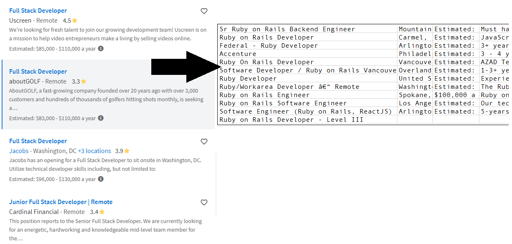

# Web Scraper
> Scan for open positions of any kind and export data into a table.<br>



<br>The main purpose here is to deploy a working app<br>
Having to learn a new librarie in a short amount of time (Less than 3 days).

## Content

* [Requirements](#requirements)
* [Built With](#built-with)
* [Getting Start](#getting-start)
* [Contributing](#contributing)
* [Acknowledgments](#acknowledgments)
* [Author](#author)
* [License](#license)

## Requirements

<ul>
  <li>Should use Nokogiri</li>
  <li>Should use Oriented Object Programming</li>
  <li>Should have unit tests</li>
  <li>Follow good practices</li>
  <li>Make it friendly to use and modify</li>
</ul>

## Built With

- Ruby Language <br>
- Nokogiri <br>
- RSpec (Unit testing) <br>
- Rubocop (Linter) with Stickler (CI Tool) <br>
- Git, Github and VScode <br>

## Getting Start

#### Install
To use this program, you will need install:
* Ruby Language - Version 2.5.5 or high - [Install guide](https://www.ruby-lang.org/en/documentation/installation/)
* Nokogiri Gem - Version 1.10.9 or high - [Install guide](https://nokogiri.org/tutorials/installing_nokogiri.html)

if you are using Ubuntu, you can install both on terminal, just typing:
```js
sudo apt-get install ruby-full
```
and
```js
sudo apt-get install ruby-full
```

#### Get a local copy
Now you need a copy of this application, if you are using Git:
```js
git clone git@github.com:SevlaMare/Web_Scraper.git
```
Otherwise just hit (Download Zip) on green button (Clone or Download) at top of this page.


#### Run (With default settings)
To run, from the application folder, just type on terminal:
```js
ruby bin/main.rb
```

When run, by default, it will generate a CSV file with data 
from one page, scrapped for 'Full Stack' open positions.

#### Modify Parameters
If you want to change which kind of position it will look for, 
or of which page you want to get the results, do the following steps:

* Open the directory `/bin` from application folder
* Open the file `main.rb` with any text editor
* At the last line, you have this:
<br>`show_all(3, true, 'ruby rails')`
* The number 3 is the page which you want to scrap, can by any available number.
* You can change the `true` to `false` if you don't want the CSV file.
* The 'ruby rails' you can change to any keyword that you want to search for open positions.
* After the changes, save the file and run it on terminal.

#### Output file
After running `data.csv` will be generated<br>
It contains 4 rows, with the position name, location, salary and description respectively.<br>
Each column will be one job post.<br>
It comes ready to be imported in any database or any spreadsheet program.<br>

### Contributing

Contributions, issues and feature requests are welcome!

You can do it on [issues page](issues/).

## Acknowledgments

A special thanks for the code reviewers.

## Author

👤 **Thiago Miranda**

- Github: [@SevlaMare](https://github.com/SevlaMare)
- Twitter: [#SevlaMare)](https://twitter.com/SevlaMare)
- Linkedin: [SevlaMare)](https://www.linkedin.com/in/sevlamare)

### License

<strong>Creative Commons</strong>
